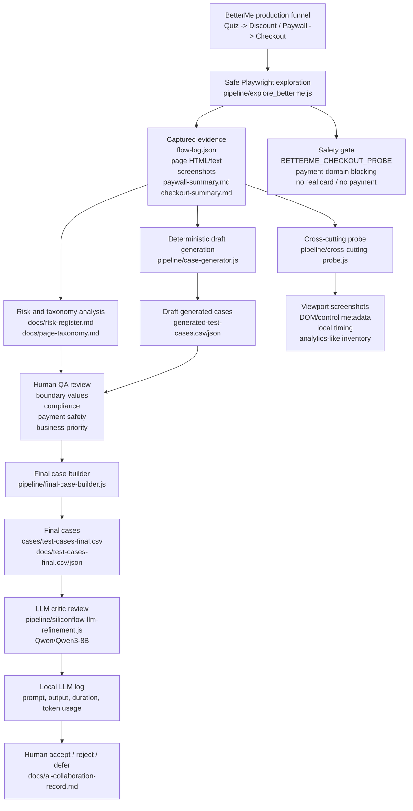
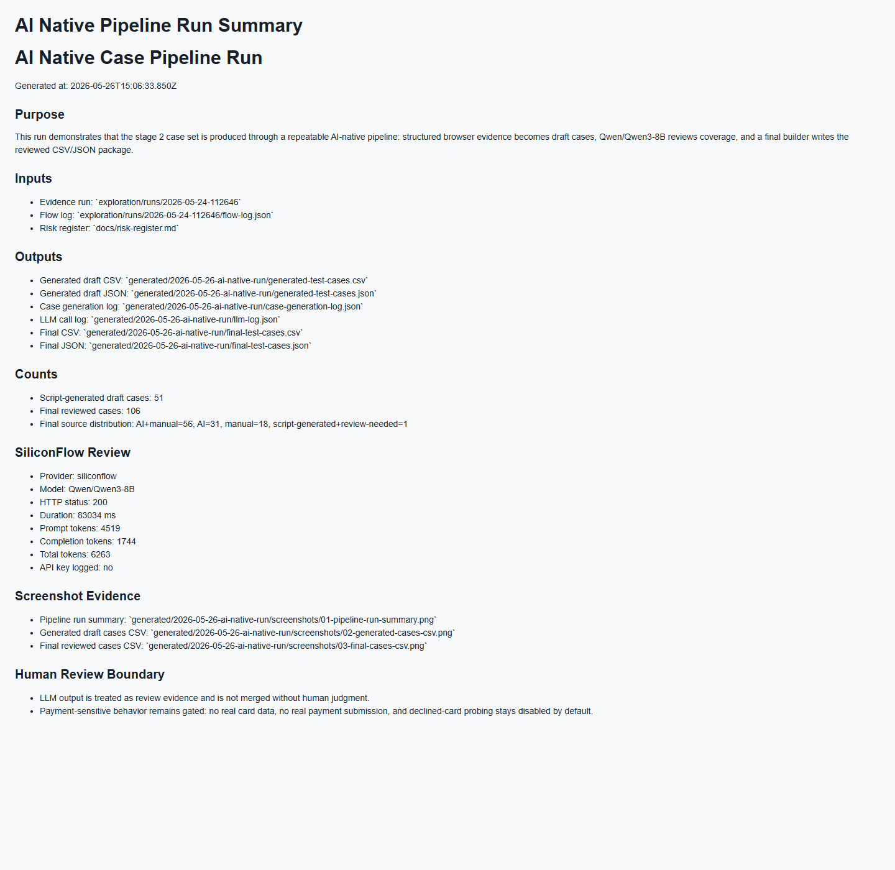
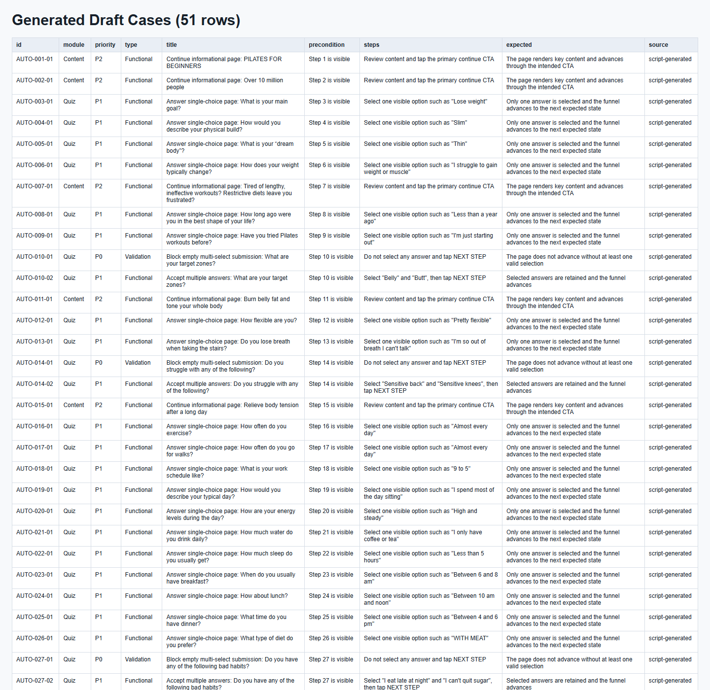
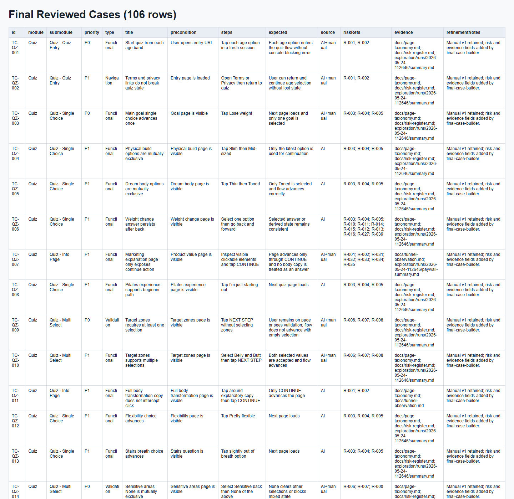
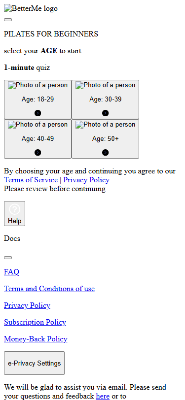

# BetterMe Pilates AI Native QA Assignment

Updated: 2026-05-24

This workspace contains a QA design and AI-assisted testing workflow for the BetterMe Pilates funnel:

`Quiz -> Discount / Paywall -> Checkout`

The work focuses on test design quality, repeatable AI/script efficiency, safe production-site exploration, and clear evidence. No real payment was submitted.

## Core Submission Deliverables

The current submission is compressed to the 4 required core deliverables:

| # | Deliverable | Stage | Format / location |
| ---: | --- | --- | --- |
| 1 | Mind map with P0/P1/P2 risk labels + Top 10 risk table | Stage 1 | `docs/stage-1-mindmap-top10-risks.md`, `docs/stage-1-mindmap-top10-risks.svg`, `docs/risk-register.md` |
| 2 | Test case set | Stage 2 | `cases/test-cases-final.csv` |
| 3 | AI efficiency script + README | Stage 3 | `pipeline/`, `README.md`, `package.json` |
| 4 | AI collaboration record | Stage 4 | `docs/ai-collaboration-record.md` |

Recommended repository structure:

```text
pipeline/   Stage 3 repeatable scripts and tests
cases/      Stage 2 final CSV test case set
docs/       Stage 1 risk map/table and Stage 4 AI collaboration record
README.md   5-minute local run guide, architecture diagram, screenshots and terminal logs
```

## Architecture



## Running Evidence

Pipeline screenshots:







Cross-cutting probe screenshot:



Terminal verification log:

```text
> npm.cmd test
1..61
# tests 61
# pass 61
# fail 0

> npm.cmd run audit
{
  "ok": true,
  "issues": []
}

> npm.cmd run build:final
finalCount: 106
outputCsvPath: cases/test-cases-final.csv
```

## Start Here

| What to review | File |
| --- | --- |
| Original task specification | `docs/task-spec/riqi-ai-native-qa-5-day-challenge.pdf` |
| Stage 1 compressed risk deliverable | `docs/stage-1-mindmap-top10-risks.md` |
| Final test case set | `cases/test-cases-final.csv` |
| Final test case set mirror | `docs/test-cases-final.csv` |
| Final case set as JSON | `docs/test-cases-final.json` |
| Assignment alignment matrix | `docs/assignment-alignment.md` |
| Reviewer guide mapped to assignment scoring | `docs/final-review-guide.md` |
| Full artifact map | `docs/project-artifacts.md` |
| Incremental delivery narrative | `docs/incremental-delivery-log.md` |
| Funnel observation | `docs/funnel-observation.md` |
| Page taxonomy | `docs/page-taxonomy.md` |
| Stage 1 and 2 task-book mapping | `docs/stage-1-2-task-book-mapping.md` |
| Risk register | `docs/risk-register.md` |
| Checkout safety record | `docs/checkout-safe-probe.md` |
| Cross-cutting coverage status | `docs/cross-cutting-coverage-status.md` |
| AI/script workflow | `docs/ai-generation-workflow.md` |
| LLM refinement record | `docs/llm-refinement-record.md` |
| Stage 4 prompt evolution archive | `docs/prompt-evolution-archive.md` |
| Stage 4 AI blind spot list | `docs/ai-blind-spots.md` |
| Stage 4 coverage review | `docs/coverage-review.md` |
| Stage 4 AI collaboration retrospective | `docs/ai-collaboration-retrospective.md` |
| Stage 4 compressed AI collaboration record | `docs/ai-collaboration-record.md` |
| AI/script architecture diagram | `docs/architecture-diagram.md` |
| Branch coverage expansion plan | `docs/branch-coverage-plan.md` |
| Submission checklist | `docs/submission-checklist.md` |
| Demo walkthrough | `docs/demo-walkthrough.md` |

## Current Deliverables

### Test Cases

The final test case set is:

- `docs/test-cases-final.csv`
- `docs/test-cases-final.json`

It contains 106 cases:

- Quiz: 55
- Paywall: 13
- Checkout: 7
- Cross-cutting: 23
- Subscription: 8

Submodule distribution:

- Quiz Entry: 2
- Single Choice: 17
- Multi Select: 7
- Info Page: 3
- Consent: 2
- Height Input: 4
- Weight Input: 2
- Goal Weight: 2
- Unit Switch: 2
- Wellness Profile: 1
- Event Question: 2
- Event Date: 2
- Loader: 3
- Email Capture: 3
- Name Capture: 3
- Discount: 4
- Paywall: 9
- Checkout: 7
- Cross-cutting: 23
- Subscription: 8

Each final case includes:

- module
- submodule
- priority
- type
- precondition
- steps
- expected result
- source
- risk references
- evidence references
- refinement notes

### Funnel and Risk Analysis

The observed funnel has been normalized into:

- `docs/funnel-observation.md`
- `docs/page-taxonomy.md`
- `docs/risk-register.md`

The risk register contains 45 risks covering Quiz progression, input validation, consent, loader behavior, discount consistency, Paywall pricing, subscription disclosure, Checkout safety, compatibility, accessibility, localization, performance, analytics, and subscription lifecycle behavior.

### Safe Checkout Probe

Checkout was explored only through a safety-gated probe:

- `BETTERME_CHECKOUT_PROBE=1`
- no real card entered
- no payment form submitted
- PayPal SDK request blocked and recorded
- TokenEx-hosted card fields captured from iframes

Evidence:

- `docs/checkout-safe-probe.md`
- `exploration/runs/2026-05-24-112646/checkout-summary.md`

Captured fields:

- cardholder name
- card number
- expiration date
- CVV
- `CONTINUE` CTA

## Automation and AI-Native Workflow

The project includes repeatable scripts rather than one-off manual AI prompting.

| Script | Purpose |
| --- | --- |
| `pipeline/explore_betterme.js` | Runs the Playwright funnel exploration and captures evidence |
| `pipeline/ai-native-case-pipeline.js` | Runs the stage-3 AI Native case pipeline end to end and saves logs, final cases and screenshots |
| `pipeline/cross-cutting-probe.js` | Renders captured funnel pages at representative viewports and writes cross-cutting evidence for compatibility, A11y, performance and analytics inventory |
| `pipeline/case-generator.js` | Generates draft test cases from `exploration/runs/2026-05-24-112646/flow-log.json` |
| `pipeline/final-case-builder.js` | Merges manual and script-generated cases into final CSV/JSON |
| `pipeline/siliconflow-llm-refinement.js` | Calls SiliconFlow `Qwen/Qwen3-8B` for a reproducible LLM review and writes `generated/2026-05-24-112646-cases/llm-log.json` |
| `pipeline/bocha-ai-refinement.js` | Optional Bocha AI Search dry-run script |

AI workflow documentation:

- `docs/ai-generation-workflow.md`
- `prompts/case-generation-v1.md`
- `prompts/case-generation-v2.md`
- `prompts/case-generation-v3.md`
- `docs/llm-refinement-record.md`
- `docs/prompt-evolution-archive.md`
- `docs/ai-blind-spots.md`
- `docs/coverage-review.md`
- `docs/ai-collaboration-retrospective.md`
- `docs/architecture-diagram.md`

The current implementation uses a deterministic script layer plus a real SiliconFlow `Qwen/Qwen3-8B` model call for the review step. This keeps the work auditable and repeatable while preserving human review before any model suggestion is merged into the final cases.

Run the SiliconFlow LLM review:

```powershell
$env:SILICONFLOW_API_KEY='<your key>'
npm run llm:siliconflow
```

Optional Bocha API dry-run:

```powershell
$env:BOCHA_API_KEY='<your key>'
npm run llm:bocha
```

Output:

- `generated/2026-05-24-112646-cases/llm-log.json`

The log records provider, endpoint, prompt, output, duration, API call count, estimated token usage, and whether the provider returned explicit usage metadata.

Run the full AI Native case pipeline, including generated draft cases, SiliconFlow review, final reviewed cases and screenshot evidence:

```powershell
$env:SILICONFLOW_API_KEY='<your key>'
npm run pipeline:ai-native
```

Latest pipeline evidence:

- `generated/2026-05-26-ai-native-run/pipeline-run-summary.md`
- `generated/2026-05-26-ai-native-run/generated-test-cases.csv`
- `generated/2026-05-26-ai-native-run/llm-log.json`
- `generated/2026-05-26-ai-native-run/final-test-cases.csv`
- `generated/2026-05-26-ai-native-run/screenshots/01-pipeline-run-summary.png`
- `generated/2026-05-26-ai-native-run/screenshots/02-generated-cases-csv.png`
- `generated/2026-05-26-ai-native-run/screenshots/03-final-cases-csv.png`

Run the cross-cutting evidence probe:

```powershell
npm run probe:cross-cutting
```

Output:

- `generated/2026-05-26-cross-cutting-probe/summary.md`
- `generated/2026-05-26-cross-cutting-probe/results.json`
- `generated/2026-05-26-cross-cutting-probe/screenshots/`

## How to Verify

Portable setup:

```powershell
npm install
npm test
npm run audit
```

The commands below use the local Codex runtime path that was used while building this workspace. They are kept as a reproducibility record, but `npm install` plus the `package.json` scripts should be preferred on a fresh machine.

Run helper and generator tests:

```powershell
& 'C:\Users\bao\.cache\codex-runtimes\codex-primary-runtime\dependencies\node\bin\node.exe' --test pipeline\tests\explore-helpers.test.js

$base='C:\Users\bao\.cache\codex-runtimes\codex-primary-runtime\dependencies\node\node_modules'
$env:NODE_PATH="$base;$base\.pnpm\playwright@1.60.0\node_modules;$base\.pnpm\playwright-core@1.60.0\node_modules"
& 'C:\Users\bao\.cache\codex-runtimes\codex-primary-runtime\dependencies\node\bin\node.exe' --test pipeline\tests\browser-actions.test.js

& 'C:\Users\bao\.cache\codex-runtimes\codex-primary-runtime\dependencies\node\bin\node.exe' --test pipeline\tests\case-generator.test.js
& 'C:\Users\bao\.cache\codex-runtimes\codex-primary-runtime\dependencies\node\bin\node.exe' --test pipeline\tests\final-case-builder.test.js
```

Check final CSV quality:

```powershell
$final = Import-Csv -LiteralPath 'docs\test-cases-final.csv'
$final.Count
($final | Where-Object { -not $_.riskRefs }).Count
($final | Where-Object { -not $_.evidence }).Count
```

Expected:

- final rows: 106
- missing risk refs: 0
- missing evidence refs: 0

## How to Re-run Exploration

Portable safe exploration:

```powershell
npm install
npx playwright install chromium
$env:BETTERME_MAX_STEPS='75'
npm run explore
```

If Playwright's bundled browser is unavailable but Microsoft Edge is installed elsewhere, set:

```powershell
$env:BETTERME_BROWSER_EXECUTABLE='C:\Path\To\msedge.exe'
```

Default safe exploration:

```powershell
$base='C:\Users\bao\.cache\codex-runtimes\codex-primary-runtime\dependencies\node\node_modules'
$env:NODE_PATH="$base;$base\.pnpm\playwright@1.60.0\node_modules;$base\.pnpm\playwright-core@1.60.0\node_modules"
$env:BETTERME_MAX_STEPS='75'
& 'C:\Users\bao\.cache\codex-runtimes\codex-primary-runtime\dependencies\node\bin\node.exe' pipeline\explore_betterme.js
```

Checkout-safe probe:

```powershell
$base='C:\Users\bao\.cache\codex-runtimes\codex-primary-runtime\dependencies\node\node_modules'
$env:NODE_PATH="$base;$base\.pnpm\playwright@1.60.0\node_modules;$base\.pnpm\playwright-core@1.60.0\node_modules"
$env:BETTERME_MAX_STEPS='75'
$env:BETTERME_CHECKOUT_PROBE='1'
& 'C:\Users\bao\.cache\codex-runtimes\codex-primary-runtime\dependencies\node\bin\node.exe' pipeline\explore_betterme.js
```

## Regenerate Cases

Generate draft cases from a run:

```powershell
npm run generate:cases
```

Run the full AI Native pipeline:

```powershell
$env:SILICONFLOW_API_KEY='<your key>'
npm run pipeline:ai-native
```

Build final cases:

```powershell
npm run build:final
```

## Safety Notes

- BetterMe is a production site.
- The scripts avoid real payment submission.
- Valid real cards must not be used.
- Checkout probing stops at field and CTA observation.
- Declined-card testing is not enabled in the current implementation.
- Declined-card probing must remain behind a separate explicit gate before any card number is entered.

## Remaining Optional Work

- Add one approved safe-region run for deeper localization evidence.
- Add Safari, mobile Safari, Firefox or WeChat real-device screenshots if devices are available.
- Convert at least 10 P0 cases into a Playwright/Cypress automation PoC for stage 5 bonus credit.
