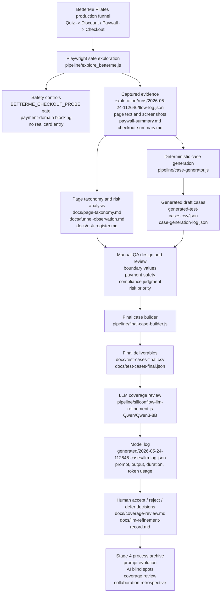

# AI Native Pipeline Architecture

Updated: 2026-05-26

This diagram shows how the repository turns a production funnel observation into a reviewable test case package. It highlights the AI call points, safety gate, and human review points required by the task specification.

## Data Flow

| Step | Artifact or script | Role |
| --- | --- | --- |
| Production observation | `pipeline/explore_betterme.js` | Drives the funnel and captures evidence without completing payment |
| Safety boundary | `pipeline/browser-actions.js`, `pipeline/explore-helpers.js` | Blocks or records payment-sensitive requests and stops at checkout observation |
| Evidence store | `exploration/runs/2026-05-24-112646` | Keeps raw page text, screenshots, structured flow logs, Paywall facts, and Checkout facts |
| Test design basis | `docs/page-taxonomy.md`, `docs/risk-register.md` | Converts raw pages into prototypes and risk IDs |
| Draft generation | `pipeline/case-generator.js` | Produces repeatable draft cases from `exploration/runs/2026-05-24-112646/flow-log.json` |
| Human intervention | `docs/test-cases-v1.csv`, review notes | Adds judgment-heavy cases such as compliance, boundary values, pricing, and payment safety |
| Final assembly | `pipeline/final-case-builder.js` | Merges manual and generated cases, adds risk refs and evidence refs |
| AI review | `pipeline/siliconflow-llm-refinement.js` | Calls an LLM as a critic, not as an automatic merger |
| Review record | `docs/coverage-review.md`, `docs/llm-refinement-record.md` | Records which model suggestions are adopted, rejected, or deferred |

## Human Control Points

- The script never submits real payment and does not enter real card data.
- Declined-card probing is disabled unless a separate explicit gate is added.
- LLM output is logged for auditability, but no suggestion is merged into the final CSV without human review.
- Manual review owns business risk priority, compliance interpretation, pricing judgment, and production safety boundaries.
