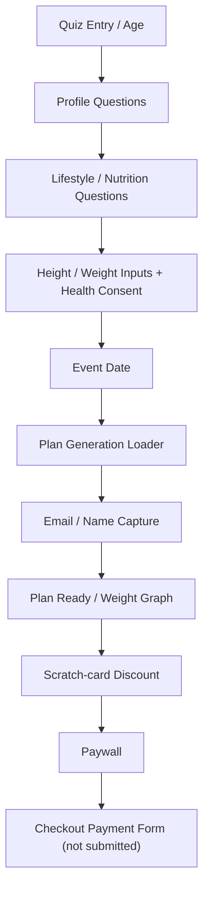

# BetterMe Pilates Funnel Observation

Updated: 2026-05-24

Current best evidence run: `exploration/runs/2026-05-24-112646`

## Executive Summary

- Playwright captured the main BetterMe Pilates flow from quiz entry through discount, Paywall, and checkout-safe payment surface inspection.
- The explored path is: `Quiz -> Discount / scratch-card -> Paywall -> embedded checkout surface`.
- No real payment was submitted.
- Discount evidence shows a `30%` discount and promo code `qa_may26`.
- Paywall evidence shows HKD pricing, plan cards, countdown content, purchase CTA, and renewal copy.
- Checkout-safe probing shows that clicking the lower `GET MY PLAN` CTA expands an embedded payment component on the Paywall page.
- Card fields are hosted in TokenEx iframes, and a PayPal SDK request was blocked and recorded.

## Funnel State Map

## Observed Facts

| Stage | Observation |
| --- | --- |
| Quiz | Main path includes single-select, multi-select, input, date, and loader pages. |
| Consent | Health onboarding data consent appears during height input. |
| Loader | Plan generation progresses through percentage states such as 3%, 35%, 67%, and 98%. |
| Email / Name | Email and name are collected before the plan-ready and purchase stages. |
| Discount | Scratch-card reveals a 30% discount and promo code `qa_may26`. |
| Paywall | Paywall shows plan cards, HKD prices, countdown text, `GET MY PLAN`, and renewal terms. |
| Checkout | Safe probe captured cardholder name, card number, expiration date, CVV, and `CONTINUE`; no payment was submitted. |

## Paywall Price Snapshot

| Plan | Original price | Discounted price | Per-day price |
| --- | --- | --- | --- |
| 1-Week Trial / 4-WEEK PLAN | HK$98.00 | HK$70.00 | HK$10.00/day |
| 4-Week Plan | HK$280.00 | HK$196.00 | HK$7.00/day |
| 12-Week Plan | HK$588.00 | HK$420.00 | HK$5.00/day |

Observed renewal copy states that after the intro plan, the user is charged HK$280.00 every 4 weeks until cancellation.

## Test Design Implications

- Quiz cases should cover page type, data boundaries, state recovery, and not only a single happy path.
- Paywall cases should cover discount carryover, pricing consistency, plan selection, countdown behavior, and subscription disclosure.
- Checkout cases must stay inside a safe boundary: inspect fields, block external payment gateways, and avoid successful payment.
- Automation can convert `flow-log.json` and `pages/*.txt` into structured page objects, then generate candidate test cases by page type.

## Recommended Follow-Up

1. Add a hard-gated declined-card PoC only if the test boundary is explicitly approved.
2. Add a second user profile path to compare page branching, price, discount, and recommendation copy.
3. Parameterize the evidence run id in the final case builder so future runs do not require code edits.
