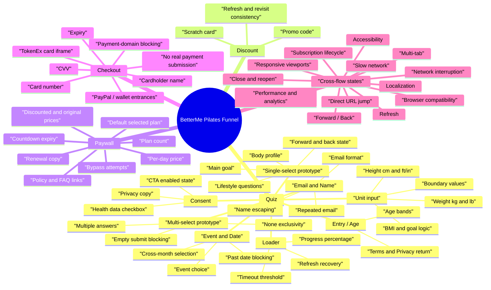

# BetterMe Funnel State Map

Updated: 2026-05-26

This state map supplements `docs/page-taxonomy.md` with the task-book requested mind-map view of the Quiz -> Discount / Paywall -> Checkout funnel. The Mermaid source is also stored at `docs/funnel-state-map.mmd` so it can be rendered or imported into a mind-map tool as outline content.

## State Transition Coverage

| Area | Transition triggers | Evidence or case-design link |
| --- | --- | --- |
| Quiz | forward, back, refresh, close/reopen, direct URL jump | `docs/page-taxonomy.md`, `docs/test-cases-final.csv` |
| Discount | scratch, continue, refresh, back/re-entry | `docs/funnel-observation.md`, `docs/test-cases-final.csv` |
| Paywall | plan select, countdown expiry, policy navigation, checkout CTA, bypass attempts | `docs/funnel-observation.md`, `docs/test-cases-final.csv` |
| Checkout | field focus, wallet entry, empty validation, invalid local validation, payment-domain block | `docs/checkout-safe-probe.md`, `docs/test-cases-final.csv` |
| Cross-cutting | responsive viewports, browser matrix, keyboard, locale/currency, slow network, analytics, subscription state inference | `docs/test-cases-coverage-extension.csv`, `docs/branch-coverage-plan.md` |

## Reviewer Note

This map is intentionally prototype-based rather than page-by-page. The task book asks candidates not to brute-force every Quiz page, so the map groups repeated Quiz screens into stable interaction types and then links those types to representative deep cases in the final CSV.
